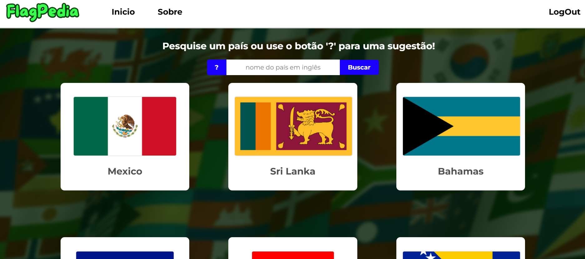
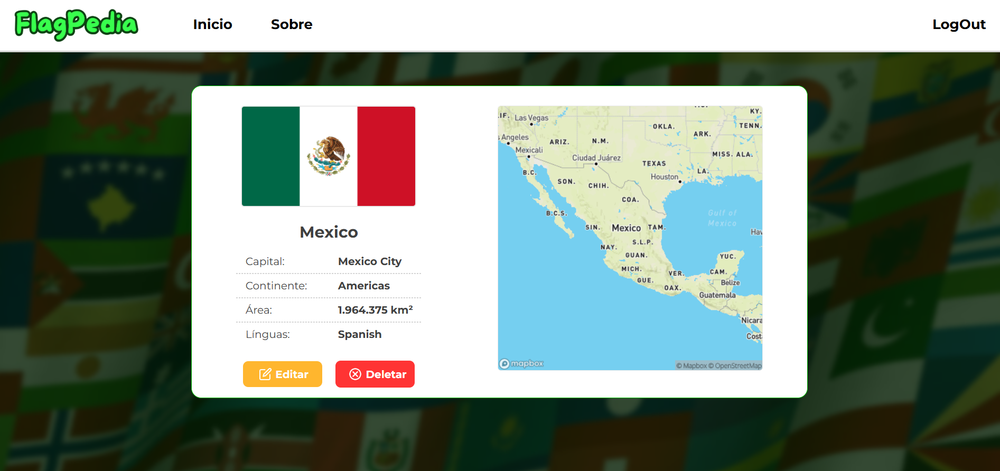

# Flagpedia

O **Flagpedia** é um projeto criado com o objetivo de permitir que o usuário pesquise países, visualize informações importantes e explore mapas estáticos gerados automaticamente.  
O site utiliza dados da **REST Countries API** e mapas da **Mapbox**, oferecendo uma interface simples, limpa e direta para exploração geográfica.

---

## Tecnologias Utilizadas

- **React.js (Vite)** — estrutura principal do front-end  
- **JavaScript (ES6+)**  
- **CSS3** com foco em UI simples e responsiva  
- **REST Countries API** — busca de informações dos países  
- **Mapbox Static Maps** — geração dos mapas exibidos nas páginas  
- **Axios** — requisições HTTP  
- **Git e GitHub** — versionamento de código  

---

## Sobre o Projeto

Desde pequeno, sempre fui aquela criança obcecada por geografia: vivia olhando mapas, decorando capitais e bandeiras, e transformando cada país em uma nova curiosidade para descobrir.  
Com o tempo, essa paixão evoluiu e, hoje, se mistura com a programação.

Esse projeto nasceu para unir duas coisas:
- Meu interesse por países, culturas e bandeiras  
- Meu aprendizado em desenvolvimento web  

O resultado é uma aplicação onde posso pesquisar países, visualizar detalhes, editar informações e explorar mapas de forma interativa.  
Feito com ❤️ por Márcio.

---

### Login

### Tela Inicial

### Card Completo

---

## 👨‍💻 Integrantes do Projeto

| Nome            | GitHub                             |
| Márcio Siqueira | https://github.com/marciosiqueira1 |
